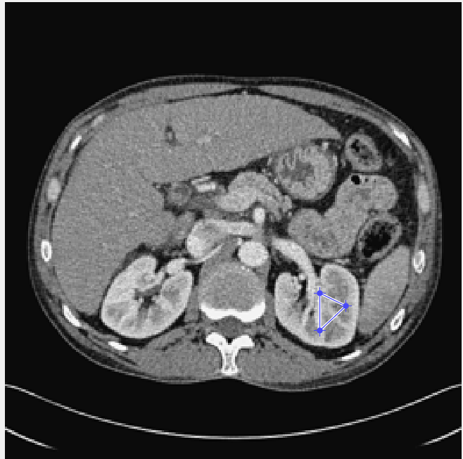
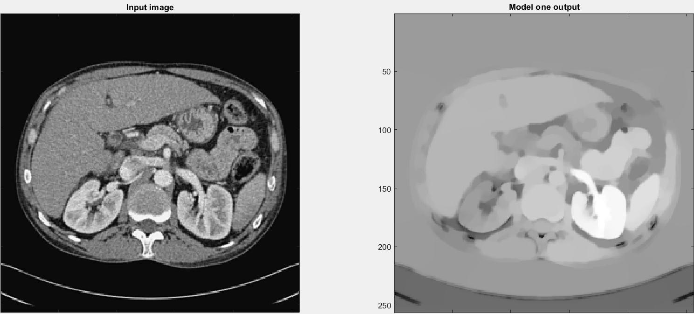
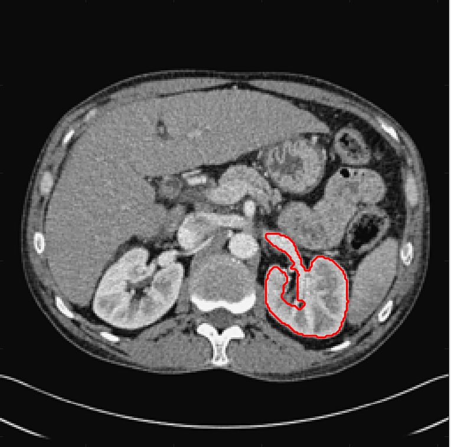

# Selective-MumfordShah
Implementation of model 1 from "On Two Convex Variational Models and Their Iterative Solutions for Selective Segmentation of Images with Intensity Inhomogeneity"

## Example input:
.

## Model output:
.

## Segmentation by thresholding:
.
